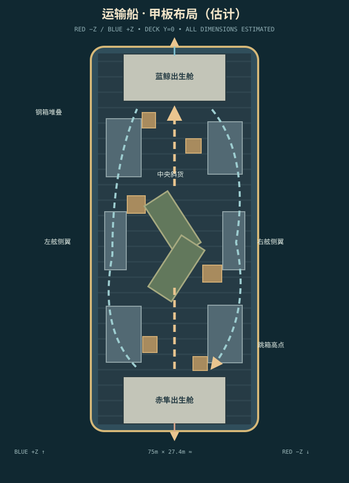

# 地图参照与重建记录

## 版本选择

以 3DM 网游 2018-05-24 的《穿越火线》端游「运输船」截图组 R05–R09 为核心视觉参照。其界面、舱体、箱组和中央绿色篷布货物在这组截图中一致。R10 的 CF2.0 介绍仅供环境氛围参考；手游、CFHD、复刻作品均不用于确定本图的主要布局。截图和网页是分析材料，不作为游戏贴图或音效。游戏内全部几何、材质、声音和 UI 由本项目程序生成。

原网页：[R04 点位文章](https://ol.3dmgame.com/gl/21161.html)。在资料检索中发现连续走图视频候选 [BV1epApz2EZS](https://www.bilibili.com/video/BV1epApz2EZS/)，但未取得可独立逐帧检查的连续视频，因此**没有以该视频确认任何连接关系，也没有编造时间戳**。细节缺证处在下文明确标为近似。

| 编号 | 页面 / 图片地址 | 本地文件及 SHA-256 | 支持的结论 | 不确定点 |
| --- | --- | --- | --- | --- |
| R05 | [俯视图](https://olimg.3dmgame.com/uploads/images/raiders/20180524/1527151074_359577.png) | `references/R05-overview.png` · `3966B2224488D4B4BE20FB9C9D1656AF5C3194117919CC7599A9155ACDCB0311` | 狭长甲板、两端舱体、中央斜置两组货物、两侧大箱体和吊机位置 | 俯视像素无法直接给出米制尺寸、侧道内部高度 |
| R06 | [箱组近景](https://olimg.3dmgame.com/uploads/images/raiders/20180524/1527151084_366917.png) | `references/R06-cargo.png` · `4A33B67B8963CBAB28BA7D983F4537F1D25FDCC4111DFA223425777A07A33CB0` | 木箱可见板条和框架、篷布与金属箱不同、舷侧栏杆与吊机 | 个别小箱的精确间距 |
| R07 | [端部舱体](https://olimg.3dmgame.com/uploads/images/raiders/20180524/1527151090_308629.png) | `references/R07-cabin.png` · `843E07F960C06A9C5B4BDDC172F67D6731417767A3955ECF2B3C8F394A22D3A1` | 白色舱壁、灰蓝集装箱、阶梯木箱、出入口前缓冲区 | 舱内房间深度和门洞尺寸 |
| R08 | [中央篷布](https://olimg.3dmgame.com/uploads/images/raiders/20180524/1527151094_994064.png) | `references/R08-diagonal.png` · `22359CB05D678BD57C22345B0C633EC8E95246C2D116107A95948F90D18BA4FC` | 绿色篷布覆盖的长形货物、绑带、木质底座 | 材料弹道由本作设定，非官方参数 |
| R09 | [高处俯瞰](https://olimg.3dmgame.com/uploads/images/raiders/20180524/1527151100_444586.png) | `references/R09-highpoint.png` · `3810B05514B6E4B1909522D54EAA26C7F58AD146069F6531A5A81B1B9D04A2FE` | 箱顶高点俯瞰中央甲板与海面、两侧层次 | 箱顶的原版跳跃链和边界未能完整核验 |

## 坐标与尺度

场景使用米作为**估计单位**，不是官方测量数据。甲板平面 `y=0`；`z=-37.2` 为赤隼端，`z=+37.2` 为蓝鲸端；`x=-13.5` 与 `x=+13.5` 为两舷。甲板估计长 75 m、宽 27.4 m。人体站姿高 1.76 m、视点 1.61 m；标准金属箱高约 2.65 m；木箱低阶 0.62 m。比例主要由 R05 的相对平面关系和 R06–R09 人物/门框/箱体近景进行一致性校准。甲板较参考图可能略长，是本作节奏和碰撞调校中的近似。



### 主要物体与语义

实际描述见 `src/map.ts` 的 `MAP_BLOCKS`。每个对象记录稳定 `id`、中心位置、角度、宽/长/高、底高、材质、可站立标记和参考编号。渲染、人物碰撞、弹道射线、遮挡及寻路栅格从同一数据构建。动态角色及烟雾不属于静态表。

| 分组 | ID 示例 | 估计位置 | 碰撞/弹道 | 站立/寻路 |
| --- | --- | --- | --- | --- |
| 两端舱体 | `red-cabin-*`, `blue-cabin-*` | `z≈±29..37` | 白色舱壁与顶棚实体阻挡 | 舱内平地，门洞分三处 |
| 外缘金属箱 | `*-port-container`, `*-starboard-container` | `x≈±9.7`, `z≈±15` | 钢制实体，不穿透 | 底层可站但需跳箱链，上层仅背景/边界 |
| 中央斜货 | `central-tarp-red`, `central-tarp-blue` | `(−2.4,−4.35)`, `(2.45,4.15)` | 货架/篷布在本作按实心货物阻挡 | 顶部可达性受跳跃高度限制 |
| 木箱阶梯 | `*-wood-*`, `*-lookout-step-*` | 两端与侧路入口 | 木材可由步枪/狙击有限穿透 | 0.62→1.22→1.82→2.57 m 连跳 |
| 侧翼通道 | `*-passage-inner/outer/roof` | `x≈±12.1`, `z≈−5.25..5.25` | 两侧钢壁与顶棚实体 | 底部连续，顶棚为高处观察面 |
| 栏杆 | `*-rail` | 舷侧与端部边界 | 人物与子弹被实心边框阻挡 | 不可站立 |

薄装饰缆绳、划痕、铆钉和细小甲板线不产生额外碰撞。各队 `SPAWNS` 在自身舱内有五个分散点，实际复活会避开重叠并选择远离可见敌人的位置。

## 路线、视线与楼层

```text
赤隼舱（-z） ─ 三处门洞 ─ 赤方缓冲甲板
                   ├─ 左中交火缝 ─ 中央斜篷布绕行 ─ 蓝方缓冲甲板 ─ 蓝鲸舱（+z）
                   ├─ 右中木箱/钢箱掩体 ─ 另一侧交火缝 ─────┘
                   ├─ 左舷入口 ─ 侧翼有顶通道 ─ 左舷出口 ────┘
                   └─ 右舷入口 ─ 侧翼有顶通道 ─ 右舷出口 ────┘
```

中央甲板保留两端相望的部分长视线，但中央斜货、外缘钢箱和局部木箱截断正中实线。靠箱边探身才能看到另一端外侧掩体，舱壁阻断对舱内的直接观察。钢壁和屋顶会阻断电脑视觉；烟雾按实际半径临时遮蔽视觉，不阻断子弹。

两条舷侧路线在截图中有侧向结构线索，但其**内部形状、顶棚和精确端口属于近似重建**。为保证单版本的可玩路线，本作设置两侧开口、有顶的短通道和邻接跳箱高点。没有足够证据确认贯穿两端的独立中央甲板下地道，因此没有添加。高处观察面可站立，吊机梁与外侧远景不可达。寻路栅格只连接同层可步行的平面；电脑默认沿甲板和底部侧道寻路，不凭投影跨越高台。

## 固定对照机位

`yaw=0` 朝蓝鲸端 `+z`，`yaw=π` 朝赤隼端。`pitch` 以正值向上。坐标单位同上；可用 `?test=1` 的只读/固定机位测试入口复现；机位变动不替换实际场景资产。

| 机位 | `(x,y,z)` | `yaw,pitch` | 核对重点 | 运行截图 |
| --- | --- | --- | --- | --- |
| 赤方出口 | `(0,0,-28.4)` | `0,0` | 两侧箱体、中央视线 | `evidence/red-exit.png` |
| 赤方交火位 | `(-4.8,0,-20)` | `0,0` | 箱组密度与中场遮挡 | `evidence/red-fire-lane.png` |
| 右侧道 | `(12.1,0,-8)` | `0,0` | 入口与内部连续性 | `evidence/starboard-route.png` |
| 中央斜货 | `(-5.3,0,-5.1)` | `π/2.8,-0.06` | 篷布/绑带与绕行缝 | `evidence/central-diagonal.png` |
| 左侧道 | `(-12.1,0,7)` | `π,0` | 另一侧入口与出口 | `evidence/port-route.png` |
| 高处 | `(-12.05,2.57,0)` | `1.05,-0.22` | 俯看甲板、海面和围护 | `evidence/high-lookout.png` |
| 蓝方交火位 | `(4.8,0,20)` | `π,0` | 反向中场视线 | `evidence/blue-fire-lane.png` |
| 蓝方出口 | `(0,0,28.4)` | `π,0` | 对称舱门与不对称箱组 | `evidence/blue-exit.png` |

## 需要进一步核验

端游同版本连续走图视频尚未取得，因而两条侧道内部、箱顶跳跃细节与个别舱门尺寸仍需人工拿原版实机逐帧对照。R05 俯视图和 R06–R09 近景支持主要轮廓和货物分类；本项目没有把近似尺度或侧道细节称为官方数据。
